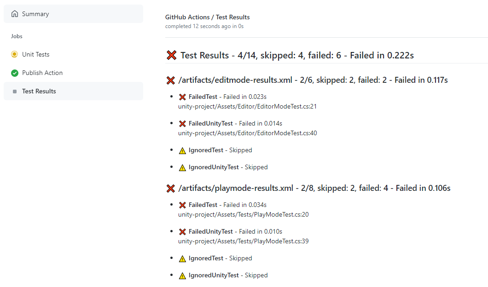

# Unity Test Publisher

<p>
  <a href="https://github.com/rainbow-duck-games/unity-test-publisher/actions?query=workflow%3A%22Action+CI%22"></a>
  <a href="https://twitter.com/RainbowDuckGms"></a>
  <a href="https://discord.gg/2b9BhDhVBJ"></a>
</p>

> :warning: **This project is not affiliated with Unity Technologies. As well even tho this project
> is inspired by [game-ci project](https://github.com/game-ci) it is not a part of Game CI community.**

This is a simple js action to parse and present Unity Test Report generated by Unity Editor.



For usage example check [unity_run_tests.yml](.github/workflows/unity_run_tests.yml) or documentation below

Inspired by the beautiful [action-surefire-report](https://github.com/ScaCap/action-surefire-report)

## Development

Install the dependencies

```bash
npm install
```

Run the tests & build

```bash
npm run all
```

## Usage

You can now consume the action by referencing the v1 branch

```yaml
uses: rainbow-duck-games/unity-test-publisher@v0.1.2
if: ${{ always() }} # Avoid skipping on failed tests
with:
  githubToken: ${{ secrets.GITHUB_TOKEN }}
```

Please check [unity_run_tests.yml](.github/workflows/unity_run_tests.yml) to find real unity build & consume of the result

## Full list of options
- `githubToken` (required) - GITHUB_TOKEN, in most cases keep it as `${{ secrets.GITHUB_TOKEN }}`
- `reportPaths` - 'glob expression to find Unity test reports, default - `./artifact/*.xml`
- `workdirPrefix` - prefix on build machine to ignore in report, default - `/github/workspace/`
- `checkName` - check name for test reports. Change it if you use more than one publisher step, default - `Test Results`
- `checkFailedStatus` - what status should be for failed check, default - `failure`, allowed values: `success`, `failure`, `neutral`, `cancelled`, `skipped`, `timed_out`, or `action_required`
- `failOnTestFailures` - fail run if there were test failures, default - `false`
- `failIfNoTests` - fail run if there were no test results found, default - `true`
